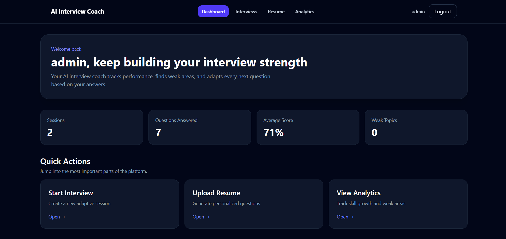
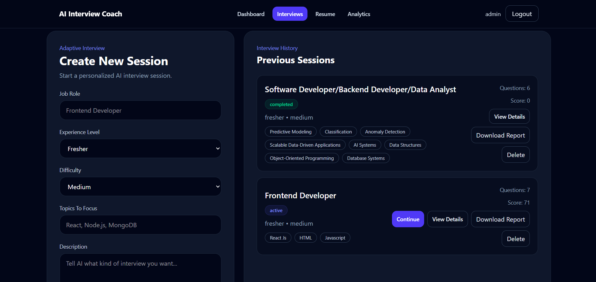
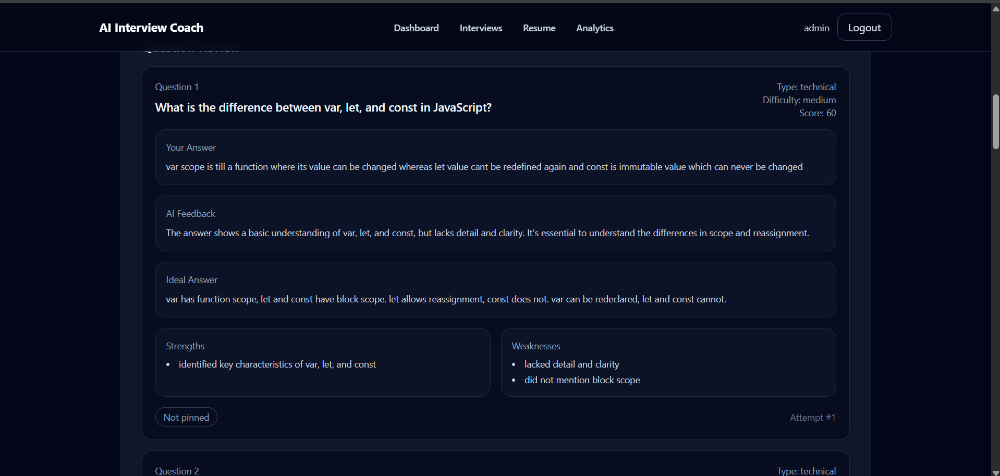
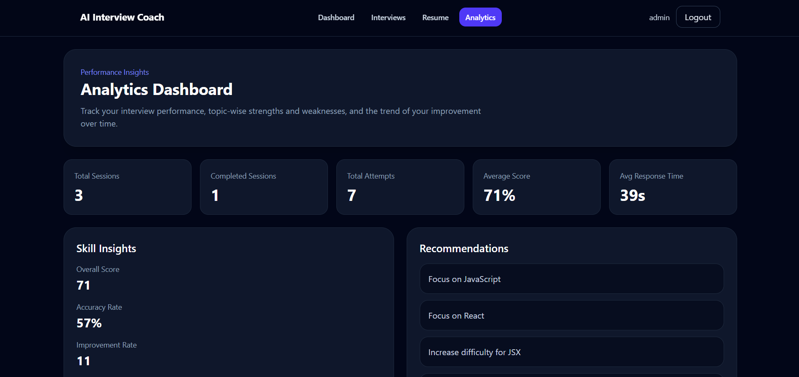

<<<<<<< HEAD
# AI Interview Preparation Platform

A full-stack AI interview preparation application that helps users practice technical and behavioral interviews with resume-aware questions, adaptive difficulty, answer evaluation, and performance analytics.

## Project Bullet Points

- Built a full-stack interview preparation platform using React, Vite, Redux Toolkit, Express.js, MongoDB, and JWT authentication.
- Implemented secure user registration and login with protected frontend routes and token-based backend authorization.
- Developed an AI-powered interview question generator that creates role-specific questions based on job role, experience level, selected topics, and question count.
- Added resume-based interview preparation where users upload a PDF or text resume, the backend extracts resume content, analyzes skills and experience, and generates personalized interview questions.
- Designed adaptive interview sessions that adjust the next question's topic and difficulty using previous answer scores and the user's weakest skill areas.
- Integrated multi-provider LLM routing with fallback support for Gemini, OpenRouter, Groq, and Hugging Face to improve reliability when one provider fails or times out.
- Created an AI answer evaluation workflow that scores user responses, identifies strengths and weaknesses, generates ideal answers, suggests follow-up questions, and stores attempt history.
- Built a skill profile system that tracks topic-wise performance, overall score, accuracy rate, response time, strongest topics, weakest topics, and improvement history.
- Developed analytics dashboards showing total sessions, completed attempts, average score, weak topics, score trends, recommendations, and recent activity.
- Added interview session history and detailed session views so users can revisit previous questions, attempts, scores, and feedback.
- Implemented voice-based interview support using browser speech recognition and speech synthesis hooks for a more realistic practice experience.
- Added PDF report generation on the frontend so users can export interview feedback and performance summaries.
- Secured the backend with Helmet, CORS allowlists, request body limits, compression, centralized error handling, and AI endpoint rate limiting.
- Used MongoDB models for users, sessions, questions, answer attempts, resume profiles, and skill profiles to maintain structured interview progress data.
- Prepared deployment configuration for hosting the frontend on Netlify, backend on Render, and database on MongoDB Atlas.

## Core Features

- Authentication: register, login, protected dashboard, and authenticated API access.
- Interview sessions: create, list, view, complete, and delete interview sessions.
- AI questions: generate questions from role, experience, topics, or uploaded resume.
- Answer evaluation: receive scores, feedback, ideal answers, strengths, weaknesses, and follow-up prompts.
- Adaptive practice: next questions are selected from weak topics and adjusted by performance.
- Resume analysis: extract resume text, detect target role, skills, experience level, projects, strengths, and gaps.
- Analytics: track progress across sessions, attempts, topics, scores, and recommendations.
- Voice mode: practice answering with speech input and listen to prompts with speech synthesis.
- PDF reports: export performance summaries and feedback from the frontend.

## Tech Stack

- Frontend: React, Vite, React Router, Redux Toolkit, Axios, Tailwind CSS, jsPDF.
- Backend: Node.js, Express.js, MongoDB, Mongoose, JWT, Multer, pdf-parse.
- AI: Gemini, OpenRouter, Groq, Hugging Face through a fallback router.
- Deployment: Netlify for frontend, Render for backend, MongoDB Atlas for database.

## Local Development

Frontend:

```bash
cd frontend/ai_interview_prep
npm install
npm run dev
```

Backend:

```bash
cd backend
npm install
npm run dev
```

Required backend environment variables:

```txt
MONGO_URI=your MongoDB Atlas connection string
JWT_SECRET=your JWT secret
CLIENT_URL=http://localhost:5173
GEMINI_API_KEY=your Gemini key
```

Optional AI fallback variables:

```txt
OPENROUTER_API_KEY=...
GROQ_API_KEY=...
HF_API_KEY=...
HF_BASE_URL=...
```

Frontend environment variable:

```txt
VITE_API_BASE_URL=http://localhost:5000/api/v1
```

## Deployment

See `DEPLOYMENT.md` for Netlify, Render, and MongoDB Atlas setup steps.
=======
<div align="center">


<br/>

**An AI-powered interview preparation platform that generates adaptive questions from your resume, evaluates your answers in real-time, and tracks your growth across sessions.**

<br/>

[](https://meek-kheer-3f184f.netlify.app/login)
[](https://reactjs.org/)
[](https://nodejs.org/)
[](https://mongodb.com/)
[](https://redux.js.org/)

</div>

---

## 📸 Screenshots

| Dashboard | Interview Session |
|-----------|------------------|
|  |  |

| AI Feedback | Analytics |
|-------------|-----------|
|  |  |

---

## ✨ What It Does

- 📄 **Resume Parser** — Upload your PDF resume; the AI reads it and generates questions tailored to your actual experience and skills
- 🎯 **Adaptive Questions** — Choose your target role, experience level, and difficulty; questions adjust accordingly
- 🤖 **Real-time AI Feedback** — Every answer gets scored with strengths, weaknesses, and an ideal answer
- 🎙️ **Voice Interview Mode** — Speak your answers using the Web Speech API (works on the live site)
- 🔄 **Multi-LLM Routing** — Groq is primary; Gemini and OpenRouter are fallbacks — if one is down, the next kicks in automatically
- 📊 **Analytics Dashboard** — Track your score trends, topic-wise performance, and weak areas across sessions
- 📥 **Downloadable Reports** — Export your session as a PDF with all questions, answers, and feedback

---

## 🛠️ Tech Stack

| Layer | Technology |
|-------|-----------|
| Frontend | React, Redux Toolkit, Tailwind CSS |
| Backend | Node.js, Express.js |
| Database | MongoDB + Mongoose |
| Auth | JWT + bcrypt |
| LLM Routing | Groq (primary) → Gemini → OpenRouter |
| Resume Parsing | pdf-parse + Multer |
| Voice | Web Speech API |
| Deployment | Netlify (frontend) · Render (backend) |

---

## 🏗️ Architecture

```
User uploads PDF resume
        ↓
Multer + pdf-parse → extract text
        ↓
Resume text + job role → LLM Router
        ↓
Groq → Gemini → OpenRouter  (fallback chain)
        ↓
Adaptive questions generated
        ↓
User answers via text or voice
        ↓
AI scores answer → Strengths / Weaknesses / Ideal Answer
        ↓
Results stored in MongoDB → Analytics Dashboard updated
```

---

## 🚀 Local Setup

```bash
# 1. Clone
git clone https://github.com/arka562/ai-interview-prep.git
cd ai-interview-prep

# 2. Backend
cd backend
npm install
cp .env.example .env    # Fill in your keys
npm run dev             # Runs on http://localhost:5000

# 3. Frontend (new terminal)
cd frontend
npm install
npm start               # Runs on http://localhost:3000
```

**Required `.env` variables (backend):**

```env
MONGO_URI=your_mongodb_connection_string
JWT_SECRET=your_jwt_secret
GROQ_API_KEY=your_groq_key
GEMINI_API_KEY=your_gemini_key
OPENROUTER_API_KEY=your_openrouter_key
```

---

## 📁 Project Structure

```
ai-interview-prep/
├── backend/
│   ├── controllers/        # Route logic
│   ├── models/             # Mongoose schemas
│   ├── routes/             # API endpoints
│   ├── middleware/         # Auth, file upload
│   └── server.js
├── frontend/
│   ├── src/
│   │   ├── components/     # Reusable UI components
│   │   ├── pages/          # Dashboard, Interviews, Resume, Analytics
│   │   ├── store/          # Redux Toolkit slices
│   │   └── App.jsx
└── README.md
```

---

## 📊 Feature Walkthrough

<details>
<summary><b>1. Resume-Based Question Generation</b></summary>
<br>
Upload any PDF resume. The backend extracts the text using <code>pdf-parse</code>, sends it to the LLM along with your selected role and difficulty, and generates questions that are specific to what's actually on your resume — not generic questions.
</details>

<details>
<summary><b>2. Voice Interview Mode</b></summary>
<br>
Click the mic button during an interview session. The Web Speech API records your spoken answer, converts it to text, and submits it for AI evaluation. Works directly on the live Netlify deployment — no additional setup needed.
</details>

<details>
<summary><b>3. Multi-LLM Fallback Chain</b></summary>
<br>
The backend tries Groq first (fastest, most reliable). If the Groq API fails or rate-limits, it automatically falls back to Gemini, then OpenRouter. This means the platform stays functional even during provider outages.
</details>

<details>
<summary><b>4. Analytics & Topic Tracking</b></summary>
<br>
Every session is stored in MongoDB. The Analytics page shows your average score, accuracy rate, improvement rate, and topic-level breakdown — so you know exactly which areas to focus on next.
</details>

---

## ⚠️ Known Limitations

- Backend is hosted on Render's free tier — **first request after inactivity may take 30–50 seconds** (cold start). The app works fine after that.
- Voice mode works best on **Chrome**. Firefox and Safari have limited Web Speech API support.

---

## 👤 Author

**Arkaprava Ghosh**  
B.Tech IoT & Intelligent Systems, Manipal University Jaipur

[](https://linkedin.com/in/your-link)
[](https://github.com/arka562)
[](mailto:your-email@gmail.com)

---

<div align="center">
  <sub>If you found this useful, drop a ⭐ — it helps with visibility.</sub>
</div>
>>>>>>> 275b2a9a749c38b4950123760a6bf4819e734654
